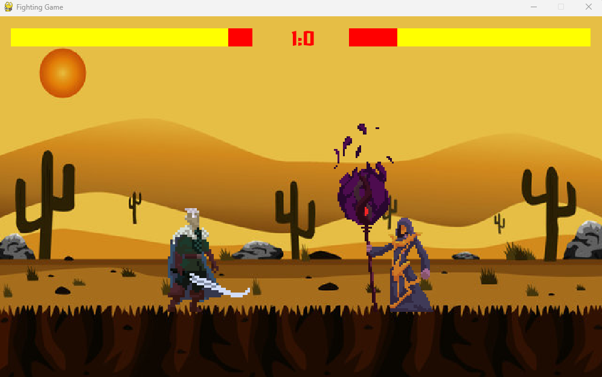

# FightingGame

A simple brawling game, created using the Python language and the PyGame library. 
The rules are simple, the player who wins two rounds first, wins.

Player 1 controls:
- W, A, S, D - move
- R, T - attack

Player 2 controls:
- KeyUp, KeyDown, KeyLeft, KeyRight - move
- Num1, Num2 - attack

